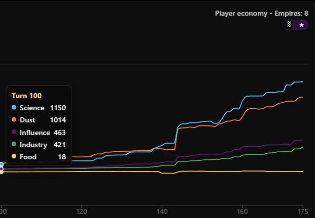
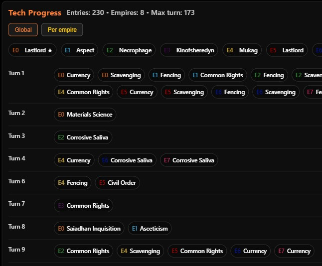

# End Game Report (Endless Legend 2)

**End Game Report** is a small analysis mod for *Endless Legend 2*.

It exports a **single JSON report at the victory screen**, containing end-game statistics and summaries that can be uploaded to **Endless Workshop** for visualization and analysis.

This mod is **read-only**:
- It does **not modify gameplay**
- It does **not edit save files**
- It does **not run during normal play**

It activates once, when a game is finished, and writes a file to disk.

***If you enjoy post-game analysis or comparing AI behavior, this mod is for you.***

 **Already convinced?**  
 👉 [Jump straight to installation instructions](#installation)

---

## What this mod does

- Exports a **single End Game Report JSON** when the victory screen appears
- Collects end-game data for **all empires in the game**
- Writes the report to a predictable folder on disk for manual upload

The report is designed to be viewed in **Endless Workshop**, where it lets you explore:

- An **overview of all empires** in the game
- A **victory graph** similar to the in-game one, with filtering per empire
- A **FIDSI graph** showing economic development over time
- A **city breakdown** with per-city data
- A full **technology order**, showing:
    - which empire researched which technology
    - on which turn  
      (this also reveals the AI’s tech progression)

All exported data is derived from the game’s end-game statistics and is **read-only**.

---

## Multiplayer note

This mod is **developed and tested for single-player games**.

It should also work in multiplayer, with one caveat:
- The exporter always treats the **host** as the “player” in the analysis

All empires are still exported and identified by faction name, but player attribution may not match expectations in multiplayer games.

---

## Example output (Endless Workshop)

You can preview what an End Game Report looks like without installing the mod:

👉 **https://endlessworkshop.dev/summary**

1. Open the link
2. Click **Load example**
3. Explore the report layout and available views

Once the mod is installed, you upload your **own** End Game Report JSON on the same page to view your finished game.

Uploading a report is read-only and does **not** affect your game, saves, or Steam account.

---

## Screenshots





---

## Installation

### 1. Install BepInEx

1. Download **BepInEx 5.x (Windows x64)**  
   https://github.com/BepInEx/BepInEx/releases

   BepInEx is a commonly used mod loader for Unity games.  
   It does not modify game files and can be removed at any time.

2. Extract it into your *Endless Legend 2* install directory
3. Launch the game once to generate the `BepInEx` folders

The game directory is typically located at:
```
C:\Program Files (x86)\Steam\steamapps\common\ENDLESS Legend 2\
```

---

### 2. Install End Game Report

1. Download `EndGameReport_v1.1.0.zip`  
   https://github.com/AdBergman/EL2StatsMod/releases/tag/v1.1.0
2. Extract the contents into the *same directory that contains* `ENDLESS Legend 2.exe`  
   (so that `BepInEx/plugins/EL2StatsMod/EL2.StatsMod.dll` exists)
3. Launch the game


---

## Usage – generating a report

1. Play a game normally
2. Reach the **victory screen**
3. The End Game Report is generated automatically
4. The JSON file is written to:
```
BepInEx/reports/
```

Example filename:
```
EL2_EndGame_20260127_212918.json
```

The full file path is also written to the BepInEx log.

---

## Uploading the report to Endless Workshop

1. Open:  
   👉 https://endlesworkshop.dev/summary
2. Upload your `EL2_EndGame_*.json` file
3. The page renders your game’s end-game data for exploration and analysis

This is the primary intended use of the mod.

---

## Uninstall

To remove the mod, delete:
```
BepInEx/plugins/EL2StatsMod/
```

You may also delete exported reports from:
```
BepInEx/reports/
```

Removing the mod does **not** affect saves or ongoing games.

---

## Troubleshooting

### No report file appears

- Make sure you reached the **victory screen**
- This mod does not export mid-game
- Check the BepInEx log file:
```
ENDLESS Legend 2\BepInEx\LogOutput.log
```

If the export succeeds, the exact file path is logged.

---

## Notes

This mod is intended as a **post-game analysis tool**.

It is safe to install and remove at any time and does not interfere with gameplay or progression.

---

## License

MIT License.  
See the root `LICENSE` file for details.
